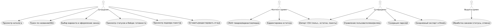

# Лабораторная работа №1
**Тема:** Формулирование требований к программной системе  
**Проект:** Веб‑приложение внутреннего магазина мерча компании / "Разработка и внедрение внутреннего интернет-магазина одежды и атрибутики компании"
**Цель работы:** Научиться анализировать поставленную задачу и формулировать функциональные и нефункциональные требования к проектируемой системе.

---
## Перечень заинтересованных лиц (стейкхолдеров)
- **Сотрудник (покупатель):** выбирает мерч, оформляет заказы за внутренние поинты, оставляет отзывы.  
- **Контент‑админ:** ведёт каталог (товары, варианты, фото), управляет остатками, выполняет импорты.  
- **Выдача‑админ:** обрабатывает заказы по стадиям (Новый → На проверке → Сборка → Готов), при необходимости отменяет; выдает .  
- **Комбо‑админ:** совмещает права контент‑ и выдача‑админа.  
- **Суперадмин:** создаёт/архивирует пользователей, назначает роли, генерирует пароли, управляет настройками и аудитом.  
- **Руководитель/офис‑менеджер:** заинтересован в прозрачности остатков и планировании закупок по отчётам.  
- **Инфобез/ИТ:** контролируют доступы, аудит и соблюдение внутренних политик.

---
## Перечень функциональных требований
**1.** Суперадмин создаёт/архивирует учётные записи пользователей и назначает ровно одну роль.  
**2.** Пользователь аутентифицируется по email+паролю; после ≥5 неудачных попыток за 15 минут вход временно блокируется.  
**3.** Каталог отображает товары по категориям (один уровень) с сортировкой по популярности.  
**4.** Поиск по названию и SKU доступен из каталога.  
**5.** Карточка товара содержит 1–10 фото, описание, цену в поинтах и выбор варианта (размер, цвет); показывается «Нет в наличии» и «мало товара» при остатке ≤5.  
**6.** Пользователь добавляет варианты в корзину и подтверждает заказ.  
**7.** При подтверждении система списывает поинты и атомарно уменьшает остаток варианта; при гонке за последнюю единицу поздний заказ автоматически Отменён, поинты возвращаются с пояснением.  
**8.** Основной жзненный цикл заказа: **Новый → На проверке → Сборка → Готов к выдаче → (авто) Завершён через 10 дней**; обратные переходы недоступны.  
**9.** На стадии «На проверке» админ подтверждает корректность; при нехватке остатка заказ авто‑отменяется с возвратом поинтов.  
**10.** Выдача‑админ может присвоить статус «Отменён» из «Нового/На проверке».  
**11.** Пользователь видит «Готово к выдаче» в шапке и профиле; при входе — модальный тикер.  
**12.** Пользователь видит историю операций с поинтами (пополнение/покупка/отмена/корректировка) с причинами.  
**13.** Контент‑админ выполняет CRUD по товарам/вариантам, корректирует остатки вручную.  
**14.** Импорт CSV (пользователи, остатки, поинты) с предпросмотром и валидацией; при неизвестных/неправильных параметрах импорт останавливается и формируется отчёт об ошибках.  
**15.** Отзывы доступны только для завершённых заказов (1–5 + текст); автор может редактировать/удалять отзыв в течение 24 часов; админ может скрыть отзыв.  
**16.** Ежедневный экспорт в Google Sheets в 07:00 Europe/Moscow с добавлением строк за последние сутки (листами: Orders, OrderItems, Stock, Ledger, Reviews) - Создано для анализа данных и построения дашбордов.

---
## Диаграмма вариантов использования

---
## Перечень сделанных предположений
- Доступ только для сотрудников; гостевого доступа нет. Язык интерфейса — RU; единая таймзона — UTC+5 (Asia/Yekaterinburg); формат дат — DD.MM.YYYY.
- Одна офисная точка самовывоза; доставка и временные слоты не используются.
- Уведомления через email/Slack отсутствуют; оповещение — только в UI (бейдж в шапке, тикер при входе).
- Поинты — целые числа; отрицательные балансы запрещены; срок годности поинтов не учитывается в расчётах.

---
## Перечень нефункциональных требований (ключевые)
- Производительность UI. 95‑й перцентиль отклика базовых операций (каталог, карточка, добавление в корзину, смена статуса) ≤ 1 с; максимальное время — ≤ 2 с. Импорт/экспорт/загрузка медиа могут выполняться фоном с индикатором прогресса.
- Нагрузка и масштаб. До 50 одновременных активных пользователей без деградации SLA отклика; общий контингент 400–600 аккаунтов.
- Доступность и восстановление. Доступность веб‑интерфейса ≥ 99% в рабочее время (09:00–18:00, UTC+5 — Asia/Yekaterinburg). Бэкапы БД ежедневно, хранение 30 дней; RPO ≤ 24 ч, RTO ≤ 2 ч.
- Безопасность. HTTPS; пароли — стойкое хеширование (Argon2id/bcrypt) с солью; политика пароля: ≥10 символов, буквы+цифры; блокировка входа после 5 неудачных попыток/15 мин; секреты — в секрет‑хранилище CI/CD.
- Наблюдаемость и аудит. Интеграция Sentry (front/back); аудит‑лог админских действий (логин с IP/UA, операции с ролями/паролями, CRUD каталога/остатков, смены статусов, операции леджера); хранение логов ≥ 30 дней; понятные сообщения об ошибках.