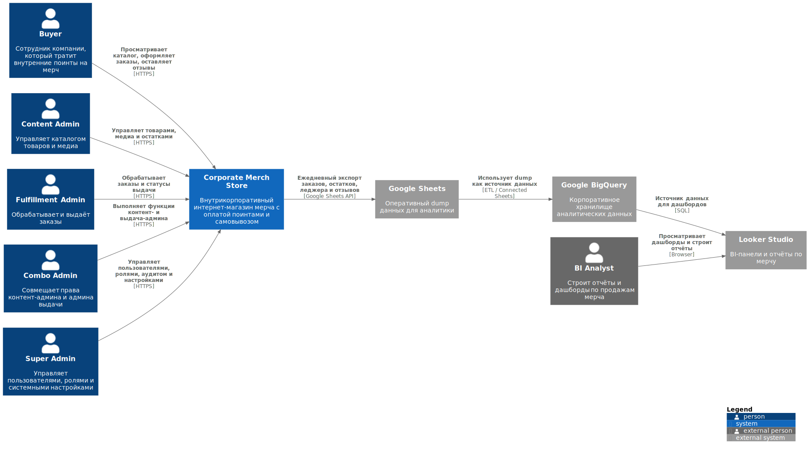
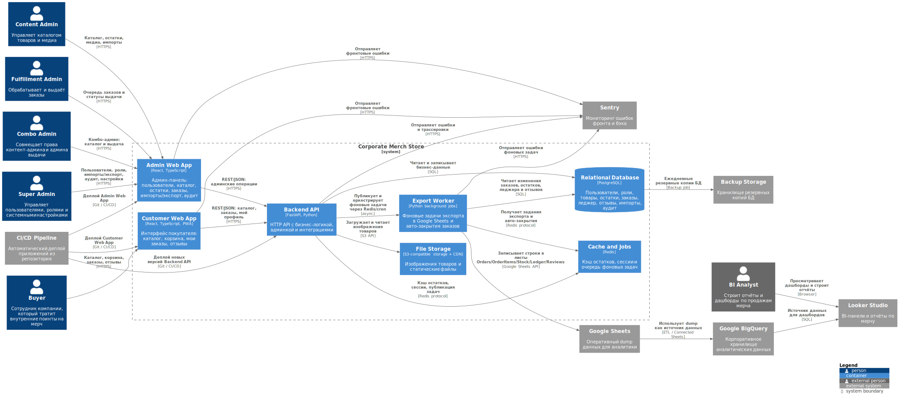
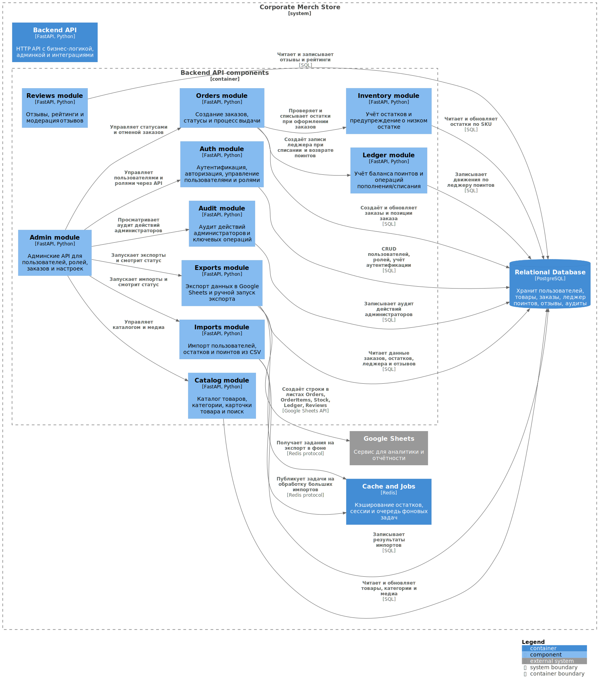
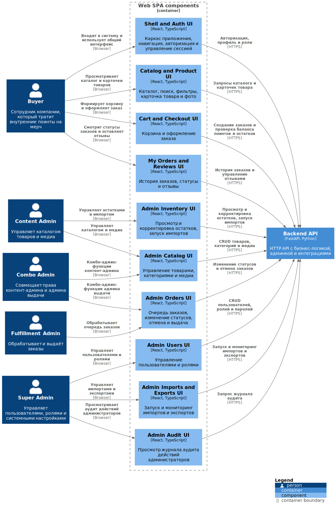

## Диаграмма системного контекста

На диаграмме системного контекста показана внутрикорпоративная система `Corporate Merch Store`, предназначенная для заказа мерча сотрудниками компании за внутренние поинты с последующей выдачей.

Выделены следующие роли пользователей:

- `Buyer` — сотрудник компании, приобретающий мерч за внутренние поинты.  
- `Content Admin` — управляет каталогом товаров, категориями и медиа-контентом.  
- `Fulfillment Admin` — обрабатывает заказы и управляет статусами выдачи.  
- `Combo Admin` — совмещает функции контент-администратора и администратора выдачи.  
- `Super Admin` — управляет пользователями, ролями и системными настройками.  
- `BI Analyst` — работает с аналитическими выгрузками по продажам мерча.

Все пользовательские роли, кроме BI-аналитика, взаимодействуют с системой `Corporate Merch Store` через веб-интерфейс по HTTPS.

Также на диаграмме показан внешний аналитический контур: данные о заказах, остатках, балансе поинтов и отзывах периодически выгружаются из системы в `Google Sheets`, где используются для оперативной аналитики и построения отчётов, с которыми работает `BI Analyst`.

Отдельно отражено внешнее хранилище резервных копий `Backup Storage`, используемое для регулярного резервного копирования базы данных системы.

---

## Диаграмма контейнеров

Диаграмма контейнеров демонстрирует разбиение системы `Corporate Merch Store` на основные исполняемые части (контейнеры) и связи между ними.

Внутри системы выделены следующие контейнеры:

- **Web App** — единое SPA-приложение на React/TypeScript, включающее пользовательский интерфейс покупателя (каталог, корзина, заказы, отзывы) и административные интерфейсы (каталог, остатки, заказы, аудит).  
- **Backend API** — серверное приложение на FastAPI (Python), реализующее бизнес-логику системы и предоставляющее REST API.  
- **Export Worker** — фоновые задачи на Python, выполняющие экспорт данных в `Google Sheets` и автоматическое завершение заказов.  
- **Relational Database (PostgreSQL)** — основное хранилище бизнес-данных: пользователи, роли, товары, остатки, заказы, леджер поинтов, отзывы, импорты и аудит.  
- **Cache and Jobs (Redis)** — инфраструктурное хранилище, используемое для кэширования остатков, хранения сессий пользователей и очередей фоновых задач.  
- **File Storage (S3-compatible)** — хранилище изображений товаров и статических файлов системы.

Внешние сервисы:

- **Google Sheets** — используется для выгрузки данных и аналитических отчётов.  
- **Backup Storage** — хранилище резервных копий базы данных.

Основные взаимодействия контейнеров:

- Пользователи работают с системой через `Web App` по HTTPS; доступные разделы интерфейса определяются ролью пользователя.  
- `Web App` обращается к `Backend API` по REST/JSON через HTTPS.  
- `Backend API` читает и записывает данные в `PostgreSQL`, использует `Redis` для кэширования, сессий и постановки фоновых задач, а также обращается к `File Storage` для работы с медиа.  
- `Export Worker` получает задания через `Redis`, читает данные из `PostgreSQL` и выгружает их в `Google Sheets`.  
- Резервное копирование данных базы выполняется во внешнее хранилище `Backup Storage`.

### Обоснование архитектурного стиля

В системе используется архитектурный стиль *клиент–сервер*:

- клиентская часть представлена контейнером `Web App` (SPA на React/TypeScript);  
- сервер приложений реализован в виде контейнера `Backend API` на FastAPI с модульной структурой доменной логики;  
- инфраструктурные хранилища включают `PostgreSQL`, `Redis` и S3-совместимое файловое хранилище.

Выбранная архитектура соответствует требованиям внутрикорпоративной системы, упрощает разработку и сопровождение, а также допускает последующее масштабирование и выделение отдельных доменных модулей.

---

## Диаграмма компонентов

В рамках работы используются две диаграммы компонентов:

1. Диаграмма компонентов контейнера **Backend API**  
2. Диаграмма компонентов контейнера **Web App**

---

### Компоненты Backend API

Диаграмма компонентов `Backend API` отражает внутреннюю декомпозицию серверного приложения.

**Входной компонент:**

- **HTTP API (routers)** — REST/JSON API для работы с каталогом, заказами, профилем пользователя и административными операциями.

**Доменные модули:**

- **Auth module** — аутентификация, авторизация и управление профилем пользователя.  
- **Users & Roles module** — управление пользователями, ролями и правами доступа.  
- **Catalog module** — каталог товаров, категории, карточки товаров и медиа.  
- **Inventory module** — учёт остатков, корректировки и импорт остатков.  
- **Orders module** — корзина, оформление заказов, управление статусами и выдачей.  
- **Ledger module** — учёт баланса поинтов и операций списания/возврата.  
- **Reviews module** — отзывы и рейтинги товаров.  
- **Imports module** — импорты данных и контроль их статусов.  
- **Exports module** — запуск задач экспорта данных.  
- **Audit module** — журналирование административных и бизнес-событий.

**Инфраструктурные компоненты:**

- **Persistence Layer** — доступ к базе данных `PostgreSQL` (репозитории / ORM).  
- **Cache & Sessions** — работа с `Redis`: сессии пользователей, кэш остатков и очереди задач.  
- **Media Gateway** — взаимодействие с `File Storage` для загрузки и чтения медиафайлов.  
- **Job Orchestrator** — постановка и оркестрация фоновых задач для `Export Worker`.

Взаимодействие компонентов организовано следующим образом: `HTTP API (routers)` маршрутизирует входящие запросы в соответствующие доменные модули. Доменные модули используют `Persistence Layer` для доступа к данным, `Cache & Sessions` для кэширования и фоновых задач, а также фиксируют значимые события через `Audit module`. Экспорт данных инициируется через `Exports module`, который публикует задания для фоновых обработчиков.

---

### Компоненты Web App

Диаграмма компонентов `Web App` показывает основные функциональные области пользовательского интерфейса и общий механизм взаимодействия с сервером.

Выделены следующие компоненты:

- **Shell and Auth UI** — каркас приложения, навигация, авторизация и управление сессией.  
- **Catalog and Product UI** — каталог товаров, поиск, фильтры и карточки товаров.  
- **Cart and Checkout UI** — корзина и оформление заказа.  
- **My Orders and Reviews UI** — история заказов, статусы и отзывы.  
- **Admin Users UI** — управление пользователями и ролями.  
- **Admin Catalog UI** — управление товарами, категориями и медиа.  
- **Admin Inventory UI** — просмотр и корректировка остатков, запуск импортов.  
- **Admin Orders UI** — управление заказами и статусами выдачи.  
- **Admin Imports and Exports UI** — запуск и контроль импортов и экспортов.  
- **Admin Audit UI** — просмотр журнала аудита.  
- **API Client** — единый HTTP-клиент для обращения к `Backend API`.

Все пользователи входят в систему через `Shell and Auth UI`, после чего получают доступ к соответствующим разделам интерфейса в зависимости от своей роли. Все UI-компоненты используют общий `API Client` для взаимодействия с серверной частью системы.

