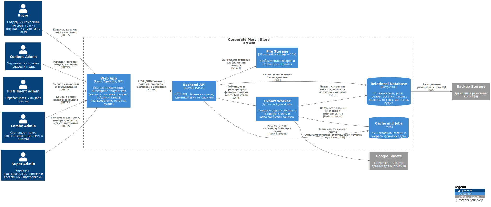
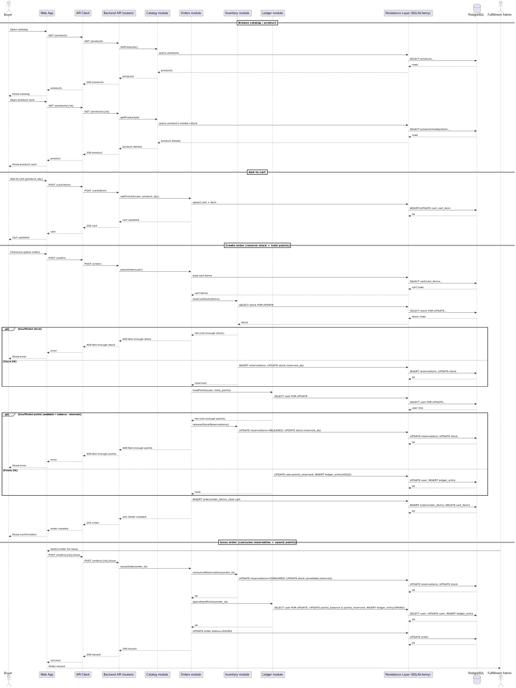
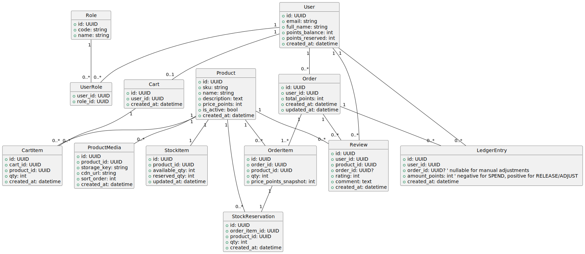

# Лабораторная работа №3 — UML (Sequence + DB) и реализация кода по принципам проектирования [Использование принципов проектирования на уровне методов и классов]

## 1. Введение и выбранный сценарий

Система `Corporate Merch Store` — внутрикорпоративный магазин мерча для сотрудников. Пользователь проходит авторизацию выбирает товар, добавляет его в корзину и оформляет заказ за внутренние поинты. Выдача заказа выполняется администратором выдачи.

Выбранный сценарий для моделирования и реализации:
**выбор товара → добавление в корзину → оформление заказа → создание заказа → выдача заказа**.

Логика учёта остатков:
**резервирование при создании заказа + списание резерва при выдаче**.


## 2. Диаграммы C4 (перенесены из ЛР-2)

### 2.1. Диаграмма системного контекста

На диаграмме системного контекста показана внутрикорпоративная система `Corporate Merch Store`, предназначенная для заказа мерча сотрудниками компании за внутренние поинты с последующей выдачей.

Выделены следующие роли пользователей:
- `Buyer` — сотрудник компании, приобретающий мерч за внутренние поинты.
- `Content Admin` — управляет каталогом товаров, категориями и медиа-контентом.
- `Fulfillment Admin` — обрабатывает заказы и управляет статусами выдачи.
- `Combo Admin` — совмещает функции контент-администратора и администратора выдачи.
- `Super Admin` — управляет пользователями, ролями и системными настройками.
- `BI Analyst` — работает с аналитическими выгрузками по продажам мерча.

Все пользовательские роли, кроме BI-аналитика, взаимодействуют с системой через веб-интерфейс. Аналитический контур: данные выгружаются в Google Sheets, далее используются как источник для загрузки в BigQuery и визуализируются в Looker Studio, где BI Analyst строит отчёты и дашборды.

Также показано внешнее хранилище резервных копий `Backup Storage`, используемое для регулярного резервного копирования базы данных.


### 2.2. Диаграмма контейнеров

Диаграмма контейнеров демонстрирует разбиение системы `Corporate Merch Store` на основные исполняемые части (контейнеры) и связи между ними. Цепочка `Google Sheets → BigQuery → Looker Studio` показана на уровне контекста, поэтому на диаграмме остаётся только `Google Sheets`.

Внутри системы выделены следующие контейнеры:
- **Web App** — единое SPA-приложение на React/TypeScript (интерфейс покупателя и административные интерфейсы).
- **Backend API** — серверное приложение на FastAPI (Python), реализующее бизнес-логику системы и REST API.
- **Export Worker** — фоновые задачи на Python, выполняющие экспорт данных в `Google Sheets` и автоматическое завершение заказов.
- **Relational Database (PostgreSQL)** — основное хранилище бизнес-данных.
- **Cache and Jobs (Redis)** — кэш, сессии и очереди фоновых задач.
- **File Storage (S3-compatible)** — хранилище изображений товаров и статических файлов.

Внешние сервисы:
- **Google Sheets** — используется для выгрузки данных и аналитических отчётов.
- **Backup Storage** — хранилище резервных копий базы данных.

Основные взаимодействия:
- Пользователи работают с системой через `Web App`; доступные разделы определяются ролью.
- `Web App` обращается к `Backend API` по REST/JSON.
- `Backend API` использует `PostgreSQL`, `Redis` и `File Storage`.
- `Export Worker` получает задания через `Redis`, читает данные из `PostgreSQL` и выгружает их в `Google Sheets`.
- Резервное копирование данных базы выполняется во внешнее хранилище `Backup Storage`.




## 3. Диаграмма последовательностей (Sequence)

### 3.1. Смысл выбранного уровня детализации

Диаграмма последовательностей построена на уровне контейнеров/компонентов, достаточном для понимания:
- как пользователь проходит путь **каталог → корзина → заказ**;
- где выполняются проверки и транзакционные изменения данных;
- как реализуется логика **резервирования остатков** и **резерва поинтов**.

В диаграмме используются ключевые участники:
`Web App → API Client → Backend API (routers) → доменные модули (Catalog/Orders/Inventory/Ledger) → Persistence (SQLAlchemy) → PostgreSQL`.

### 3.2. Бизнес-правила сценария

**Создание заказа:**
1. Система читает позиции корзины.
2. Проверяет остатки по каждой позиции и создаёт резерв (`StockReservation`), увеличивая `StockItem.reserved_qty`.
3. Проверяет доступные поинты пользователя:  
   `available_points = points_balance - points_reserved`.
4. Резервирует поинты, увеличивая `points_reserved` и добавляя запись в `LedgerEntry` типа `HOLD`.
5. Создаёт `Order` и `OrderItem`, очищает корзину.

**Выдача заказа:**
1. Система “потребляет” резерв: `StockReservation.status = CONSUMED`, `StockItem.reserved_qty -= qty`, `StockItem.available_qty -= qty`.
2. Списание поинтов: `points_balance -= total`, `points_reserved -= total`, запись в `LedgerEntry` типа `SPEND`.
3. Заказ переводится в статус `ISSUED`.

**Альтернативные ветви:**
- недостаточно остатков → заказ не создаётся;
- недостаточно поинтов → резерв остатков снимается, заказ не создаётся.

### 3.3. Диаграмма




## 4. Модель базы данных (UML class diagram)

### 4.1. Принятые решения и корректность модели

Модель данных разработана под процесс покупки и выдачи, и включает в себя:
- каталог: `Product`, `ProductMedia`;
- корзина: `Cart`, `CartItem`;
- заказ: `Order`, `OrderItem`;
- остатки: `StockItem`, резервирование `StockReservation`;
- поинты: `User.points_balance`, `User.points_reserved`, журнал операций `LedgerEntry`;
- роли: `Role`, `UserRole`;
- отзывы: `Review`.

Ключевой момент корректности:  
для обеспечения логики “резерв при создании — списание при выдаче” введены:
- `StockReservation` (резерв остатков),
- `points_reserved` (резерв поинтов),
- `LedgerEntry` с типами `HOLD / RELEASE / SPEND`.

Это устраняет проблему текущего решения “заказ создан и товар зарезервирован, но поинты потрачены до выдачи”.

### 4.2. Диаграмма




## 5. Применение основных принципов разработки (KISS/YAGNI/DRY/SOLID)

В рамках лабораторной приведены небольшие фрагменты кода, демонстрирующие применение принципов проектирования в контексте выбранного сценария (каталог → корзина → заказ → выдача). Код является демонстрационным и не претендует на полноту реализации продукта.

---

### 5.1. KISS (Keep It Simple, Stupid)

Принцип: один метод выполняет один понятный сценарий. Создание заказа вынесено в отдельную функцию без смешивания с выдачей, экспортом и т.п.

```python
def place_order(user_id: str) -> str:
    """
    Сценарий: создать заказ (резерв остатков + резерв поинтов).
    """
    items = cart_repo.get_items(user_id)
    inventory.reserve(items)       # резерв остатков
    ledger.hold_points(user_id)    # резерв поинтов
    order_id = orders_repo.create(user_id, items)
    cart_repo.clear(user_id)
    return order_id
```
Почему это KISS: функция делает ровно один бизнес-процесс и не разрастается.

### 5.2. YAGNI (You Aren’t Gonna Need It)

Принцип: не добавлять функциональность на будущее. Например, не вводить микросервисы/саги/сложные очереди, если сценарий решается транзакцией в БД.

```python
with db.begin():
    inventory.reserve(items)
    ledger.hold_points(user_id, total_points)
    orders_repo.create(user_id, items, total_points)
```

Почему это YAGNI: сознательно не используются сложные механизмы, пока они не нужны для требований сценария.

### 5.3. DRY (Don’t Repeat Yourself)

Принцип: общий повторяемый код выносится в одно место. Пример: единый helper для выполнения транзакции и маппинга ошибок.

```python
def in_tx(db, fn):
    try:
        with db.begin():
            return fn()
    except Exception as e:
        raise DomainError(str(e))  # единый формат ошибок домена

order_id = in_tx(db, lambda: orders_service.place_order(user_id))
```

Почему это DRY: транзакционность и обработка ошибок не копируются во всех эндпоинтах, а переиспользуется.


### 5.4. SOLID (SRP + DIP в демонстрационном виде)
#### SRP (Single Responsibility Principle)

Каждый модуль отвечает за свою область: Inventory — остатки/резервы, Ledger — поинты, Orders — статус и жизненный цикл заказа.

```python
class InventoryService:
    def reserve(self, items): ...
    def consume(self, order_id): ...

class LedgerService:
    def hold_points(self, user_id, amount): ...
    def spend_held(self, order_id): ...
```

SRP: ответственность разделена по доменам

#### DIP (Dependency Inversion Principle)

Сервис зависит от абстракций (интерфейсов репозиториев), а не от конкретной реализации хранения.

```python
from typing import Protocol

class OrdersRepo(Protocol):
    def create(self, user_id: str, items, total_points: int) -> str: ...

class OrdersService:
    def __init__(self, repo: OrdersRepo):
        self.repo = repo

    def create_order(self, user_id: str, items, total_points: int) -> str:
        return self.repo.create(user_id, items, total_points)
```

## 6. Дополнительные принципы
### 6.1. SoC (Separation of Concerns)
UI не содержит бизнес-логики. UI вызывает API, бизнес-правила находятся на сервере.

### 6.2. MVP (Minimum Viable Product)
В MVP включены только необходимые операции сценария: каталог, корзина, заказ, выдача.

### 6.3. PoC (Proof of Concept)
PoC демонстрирует блокировку строки остатков.
```sql
SELECT * FROM stock_items WHERE product_id = :pid FOR UPDATE;
```
Минимальная проверка технического риска, часто без UI, без полноценной архитектуры.

### 6.4. BDUF (Big Design Up Front)
Проектируются только сущности и связи, необходимые для выбранного сценария, без избыточных доменов.