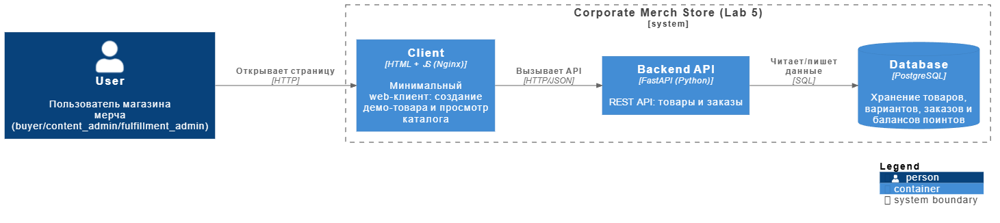
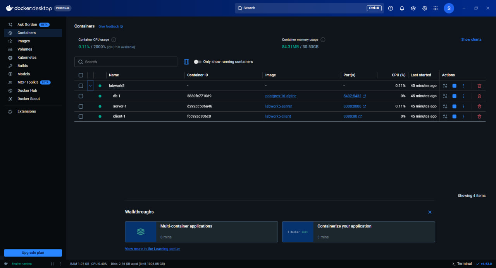
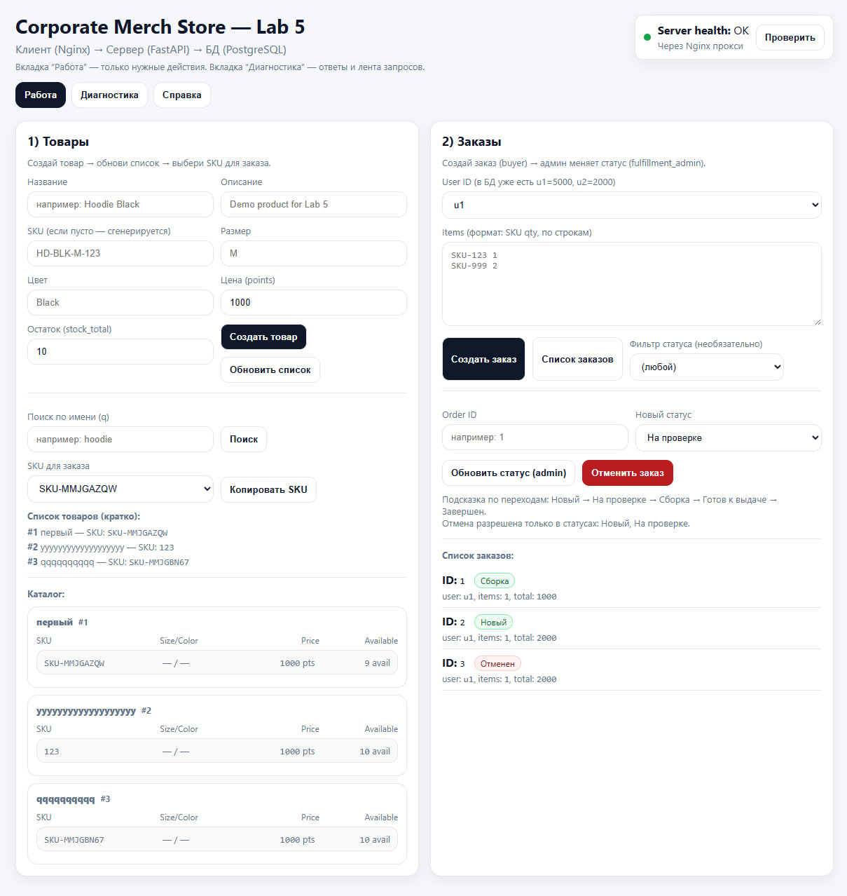
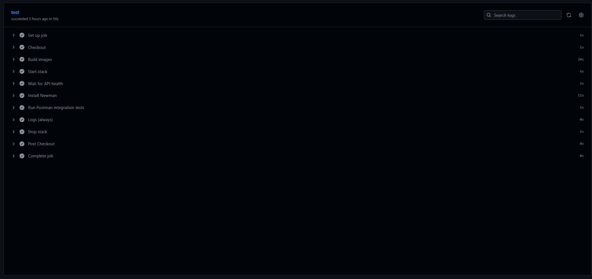
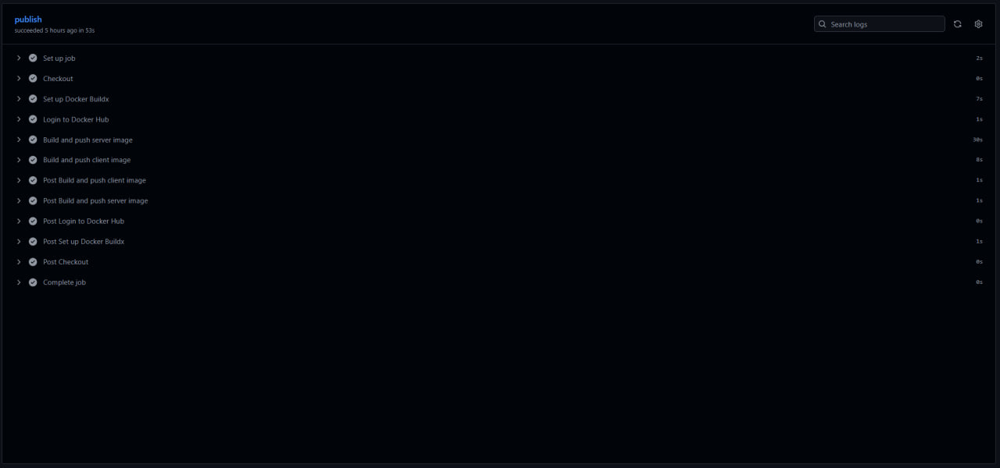

# Лабораторная работа № 5
## Контейнеризация приложения, настройка CI/CD и интеграционного тестирования

## 1. Цель работы

Целью лабораторной работы являлось развертывание программной системы в контейнерной среде, выделение клиентской, серверной части и базы данных в отдельные сервисы, настройка их взаимодействия через Docker Compose.

В рамках работы требовалось обеспечить:
- запуск многоконтейнерного приложения;
- корректное взаимодействие frontend, backend и базы данных;
- автоматическую проверку приложения с помощью интеграционных тестов;
- автоматическую публикацию Docker-образов в Docker Hub.

## 2. Состав и архитектура системы

Итоговая система состоит из трех контейнеров:
- `client` — клиентская часть;
- `server` — серверная часть;
- `db` — база данных PostgreSQL.

Пользователь взаимодействует с приложением через браузер. Запросы поступают в контейнер `client`, который отдает статические файлы интерфейса и проксирует обращения к API в контейнер `server`. Серверная часть обрабатывает бизнес-логику и выполняет операции с данными в контейнере `db`.

Рисунок 1 — Общая архитектура контейнерного решения

## 3. Описание контейнеров

### 3.1 Контейнер client

Контейнер `client` предназначен для предоставления пользовательского интерфейса. Внутри контейнера используется Nginx, обеспечивающий раздачу статических файлов и проксирование API-запросов.

Основные файлы:
- `client/index.html`
- `client/app.js`
- `client/nginx.conf`
- `client/Dockerfile`

Функции клиентской части:
- создание товаров;
- получение каталога;
- создание заказов;
- просмотр списка заказов;
- изменение статуса заказа;
- отмена заказа;
- вывод диагностической информации.

### 3.2 Контейнер server

Контейнер `server` реализует backend-приложение на FastAPI. Он принимает запросы от frontend, выполняет проверку прав доступа, обрабатывает бизнес-логику и взаимодействует с PostgreSQL.

Основные файлы:
- `server/app/main.py`
- `server/requirements.txt`
- `server/Dockerfile`

Основные функции:
- проверка доступности сервиса;
- работа с товарами;
- работа с заказами;
- изменение статусов заказов;
- отмена заказов;
- проверка ролей пользователей.

### 3.3 Контейнер db

Контейнер `db` построен на основе PostgreSQL и используется для хранения всех данных приложения.

В базе данных сохраняются:
- товары;
- варианты товаров;
- заказы;
- позиции заказов;
- пользовательские балансы.

Рисунок 2 — Запущенные контейнеры в Docker Desktop

## 4. Docker Compose и запуск системы

Совместный запуск сервисов выполняется с помощью файла `docker-compose.yml`. Данная конфигурация позволяет описать состав контейнеров, проброс портов, зависимости сервисов и параметры подключения к базе данных.

Для запуска системы используется команда:

    docker compose up --build

Для остановки контейнеров и удаления томов используется команда:

    docker compose down -v

После запуска приложение доступно по следующим адресам:

    http://localhost:8080
    http://localhost:8000/health

Первый адрес используется для доступа к пользовательскому интерфейсу, второй — для проверки состояния backend.

## 5. Описание серверной части

Backend реализует REST API для корпоративного магазина мерча.

Основные эндпоинты:
- `GET /health`
- `POST /api/v1/products`
- `GET /api/v1/products`
- `GET /api/v1/products/{id}`
- `POST /api/v1/orders`
- `GET /api/v1/orders`
- `PUT /api/v1/orders/{id}/status`
- `DELETE /api/v1/orders/{id}`

В приложении используется ролевая модель доступа:
- `content_admin` — управление товарами;
- `buyer` — создание и просмотр заказов;
- `fulfillment_admin` — изменение статусов заказов.

Серверная часть также контролирует:
- корректность структуры запросов;
- доступность товара;
- достаточность пользовательского баланса;
- допустимость переходов между статусами заказа.

## 6. Описание клиентской части

Frontend предназначен для ручной проверки и демонстрации работы API. Через интерфейс можно выполнять основные операции с товарами и заказами.

Рисунок 3 — Работа пользовательского интерфейса

## 7. Схема данных  

В приложении используется реляционная схема данных.

Основные сущности:
- **Товар** — хранит общую информацию о товаре;
- **Вариант товара** — содержит SKU, цену и доступность;
- **Заказ** — хранит данные о заказе пользователя;
- **Позиция заказа** — описывает состав заказа;
- **Баланс пользователя** — используется для проверки возможности оформления заказа.

## 8. Интеграционные тесты

Для проверки API использованы интеграционные тесты Postman, запускаемые через Newman.

Используемые файлы:
- `tests/postman/Lab4_Merch_autotests.postman_collection.json`
- `tests/postman/Lab4_Local_autotests.postman_environment.json`

Тесты покрывают следующие сценарии:
- создание товара;
- проверка duplicate SKU;
- получение списка товаров;
- получение товара по идентификатору;
- создание заказа;
- отказ при недостаточном балансе;
- получение списка заказов;
- изменение статуса заказа;
- запрет изменения статуса при неверной роли;
- отмена заказа;
- запрет отмены заказа в недопустимом состоянии.

## 9. Настройка CI

Для проекта был настроен GitHub Actions workflow, расположенный по пути:

    .github/workflows/ci.yml

Этап CI выполняет:
1. получение исходного кода;
2. сборку Docker-образов;
3. запуск контейнеров;
4. ожидание готовности backend;
5. установку Newman;
6. запуск интеграционных тестов;
7. вывод логов;
8. остановку контейнеров.

Настройка CI позволила автоматизировать проверку проекта после внесения изменений в репозиторий.

Рисунок 4 — Успешное выполнение job test в GitHub Actions

## 10. Настройка CD

Дополнительно был реализован этап CD. После успешного прохождения тестов Docker-образы автоматически публикуются в Docker Hub.
Используемые репозитории Docker Hub:
- `saurusel/paps-labwork5-server`
- `saurusel/paps-labwork5-client`

Этап CD выполняет:
1. авторизацию в Docker Hub;
2. сборку образа server;
3. публикацию образа server;
4. сборку образа client;
5. публикацию образа client.

В качестве тегов используются:
- `latest`;
- SHA коммита.

Рисунок 5 — Успешное выполнение job publish в GitHub Actions

## 12. Вывод

В ходе выполнения лабораторной работы были реализованы контейнеризация приложения, автоматизированная проверка его работоспособности и публикация контейнерных образов. Полученное решение представляет собой воспроизводимую многоконтейнерную систему, пригодную как для локального запуска, так и для автоматической сборки, тестирования и публикации.

Поставленные цели лабораторной работы достигнуты в полном объеме.