# Лабораторная работа № 6 - Применение паттернов проектирования GoF и GRASP

## 1. Цель работы

Целью лабораторной работы являлось применение паттернов проектирования GoF и подхода GRASP при развитии архитектуры существующей программной системы.

## 2. Исходная система и причины архитектурного рефакторинга

В качестве основы для лабораторной работы использован проект **Corporate Merch Store**, разработанный в предыдущих лабораторных работах. Система предназначена для автоматизации внутреннего магазина корпоративного мерча и поддерживает публикацию товаров, оформление заказов, управление статусами заказов, списание и возврат корпоративных баллов, а также учёт складских остатков.

На момент начала выполнения лабораторной работы в системе уже были реализованы:
- backend на FastAPI;
- база данных PostgreSQL;
- frontend-клиент;
- контейнеризация через Docker Compose;
- базовые бизнес-сценарии работы с товарами и заказами.

Исходная реализация обеспечивала работоспособность системы, однако значительная часть бизнес-логики была сосредоточена в крупных функциях и обработчиках. Это осложняло сопровождение, повторное использование кода, расширение правил обработки заказов и развитие архитектуры в целом.
В связи с этим в данной лабораторной работе был выполнен архитектурный рефакторинг системы с применением паттернов GoF и принципов GRASP.

## 3. Основные изменения в архитектуре

В ходе рефакторинга backend-приложение было разделено на несколько логических слоёв:
- `db.py` — подключение к базе данных и работа с сессией;
- `models.py` — ORM-модели;
- `schemas.py` — Pydantic-схемы;
- `repositories/` — интерфейсы и реализации доступа к данным;
- `services/` — бизнес-логика, команды, состояния, стратегии, наблюдатели, валидаторы и сервисы управления заказами;
- `api/` — HTTP-роуты приложения.

Такое разделение позволило отделить транспортный уровень, бизнес-логику и доступ к данным, а также подготовило систему к внедрению паттернов проектирования.

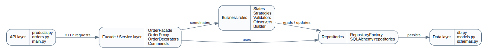
Рисунок 1 — Общая схема backend после архитектурного рефакторинга

## 4. Применение паттернов GoF

### 4.1. Порождающие паттерны

#### 4.1.1. Abstract Factory

**Общее назначение:**  
Паттерн Abstract Factory предназначен для создания семейств взаимосвязанных объектов без указания их конкретных классов.

**Назначение в проекте:**  
В проекте паттерн используется для создания набора репозиториев, работающих с товарами, заказами, пользовательскими баллами и журналом операций. Фабрика инкапсулирует создание конкретных SQLAlchemy-репозиториев и предоставляет единую точку доступа к слою данных.

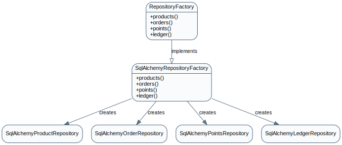
Рисунок 2 — UML-диаграмма паттерна Abstract Factory

**Фрагмент кода:**
```python
class SqlAlchemyRepositoryFactory:
    def __init__(self, db: Session):
        self.db = db

    def products(self):
        return SqlAlchemyProductRepository(self.db)

    def orders(self):
        return SqlAlchemyOrderRepository(self.db)

    def points(self):
        return SqlAlchemyPointsRepository(self.db)

    def ledger(self):
        return SqlAlchemyLedgerRepository(self.db)
```

**Результат применения:**  
Использование Abstract Factory позволило изолировать создание объектов доступа к данным и уменьшить зависимость бизнес-логики от конкретных реализаций репозиториев.

#### 4.1.2. Factory Method

**Общее назначение:**  
Паттерн Factory Method определяет интерфейс для создания объекта, позволяя отдельному методу выбирать конкретную реализацию.

**Назначение в проекте:**  
В проекте паттерн используется для выбора конкретной стратегии обработки перехода заказа в новое состояние. В зависимости от целевого статуса создаётся соответствующая стратегия.

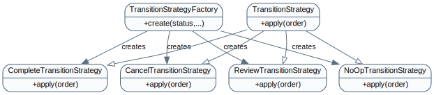
Рисунок 3 — UML-диаграмма паттерна Factory Method

**Фрагмент кода:**
```python
class TransitionStrategyFactory:
    @staticmethod
    def create(target_status: str, inventory_port, points_port, event_bus: EventBus) -> TransitionStrategy:
        if target_status == "На проверке":
            return ReviewTransitionStrategy(inventory_port)
        if target_status == "Отменен":
            return CancelTransitionStrategy(inventory_port, points_port, event_bus)
        if target_status == "Завершен":
            return CompleteTransitionStrategy(inventory_port, event_bus)
        return NoOpTransitionStrategy()
```

**Результат применения:**  
Паттерн позволил убрать жёсткие ветвления по статусам из бизнес-логики и упростил расширение системы новыми вариантами обработки.

#### 4.1.3. Builder

**Общее назначение:**  
Паттерн Builder предназначен для пошагового создания сложного объекта.

**Назначение в проекте:**  
В проекте Builder используется для сборки заказа на основе входного payload, списка позиций, вычисления итоговой стоимости и формирования связанных объектов `Order` и `OrderItem`.

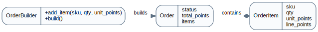
Рисунок 4 — UML-диаграмма паттерна Builder

**Фрагмент кода:**
```python
from __future__ import annotations

from app.models import Order, OrderItem
from app.utils import now_iso


class OrderBuilder:
    def __init__(self, user_id: str):
        self.order = Order(
            user_id=user_id,
            status="Новый",
            total_points=0,
            created_at=now_iso(),
            updated_at=now_iso(),
            reserved=False,
        )

    def add_item(self, sku: str, qty: int, unit_points: int):
        line_points = qty * unit_points
        self.order.items.append(
            OrderItem(
                sku=sku,
                qty=qty,
                unit_points=unit_points,
                line_points=line_points,
            )
        )
        self.order.total_points += line_points
        return self

    def build(self) -> Order:
        return self.order
```

**Результат применения:**  
Применение Builder позволило отделить логику построения заказа от контроллера и фасада, а также повысить читаемость и расширяемость процесса создания заказа.

### 4.2. Структурные паттерны

#### 4.2.1. Facade

**Общее назначение:**  
Паттерн Facade предоставляет упрощённый интерфейс к сложной подсистеме.

**Назначение в проекте:**  
В проекте Facade реализован в виде единого сервиса управления заказами, который координирует создание заказа, изменение его статуса, отмену, взаимодействие с репозиториями, валидаторами, стратегиями и наблюдателями.

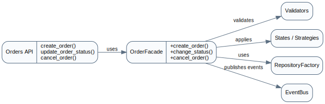
Рисунок 5 — UML-диаграмма паттерна Facade

**Фрагмент кода:**
```python
class OrderFacade:
    def __init__(self, repo_factory, validator_chain, inventory_port, points_port, event_bus):
        self.repo_factory = repo_factory
        self.validator_chain = validator_chain
        self.inventory_port = inventory_port
        self.points_port = points_port
        self.event_bus = event_bus

    def create_order(self, payload, *, x_role: str | None, x_user_id: str | None):
        ctx = {"x_user_id": x_user_id, "items": payload.items}
        self.validator_chain.handle(ctx)

        products_repo = self.repo_factory.products()
        orders_repo = self.repo_factory.orders()

        skus = [item.sku for item in payload.items]
        variants = products_repo.get_variants_by_skus(skus)
        by_sku = {variant.sku: variant for variant in variants}

        builder = OrderBuilder(user_id=str(x_user_id))
        for item in payload.items:
            variant = by_sku[item.sku]
            builder.add_item(item.sku, int(item.qty), int(variant.price_points))

        order = builder.build()

        try:
            saved = orders_repo.add(order)
            self.points_port.debit_for_order(saved.user_id, int(saved.total_points), int(saved.id))
            orders_repo.commit()
        except Exception:
            orders_repo.rollback()
            raise

        self.event_bus.publish("order_created", {"order_id": saved.id, "user_id": saved.user_id})
        return saved

    def change_status(self, order_id: int, target_status: str, *, x_role: str | None):
        orders_repo = self.repo_factory.orders()
        order = orders_repo.get(order_id)
        if not order:
            api_error(404, "NOT_FOUND", "Заказ не найден.", {"order_id": order_id})

        state = OrderStateFactory.create(order.status)
        state.ensure_can_transition(target_status)
        strategy = TransitionStrategyFactory.create(target_status, self.inventory_port, self.points_port, self.event_bus)

        try:
            strategy.apply(order)
            order.status = target_status
            order.updated_at = now_iso()
            orders_repo.commit()
        except Exception:
            orders_repo.rollback()
            raise

        self.event_bus.publish(
            "order_status_changed",
            {"order_id": order.id, "user_id": order.user_id, "status": order.status},
        )
        return order

    def cancel_order(self, order_id: int, *, x_role: str | None, x_user_id: str | None):
        orders_repo = self.repo_factory.orders()
        order = orders_repo.get(order_id)
        if not order:
            api_error(404, "NOT_FOUND", "Заказ не найден.", {"order_id": order_id})

        if x_role == "buyer":
            if not x_user_id:
                api_error(422, "VALIDATION_ERROR", "Не передан X-User-Id.")
            if order.user_id != x_user_id:
                api_error(403, "FORBIDDEN", "Нельзя отменить чужой заказ.")

        state = OrderStateFactory.create(order.status)
        state.ensure_can_transition("Отменен")
        strategy = TransitionStrategyFactory.create("Отменен", self.inventory_port, self.points_port, self.event_bus)

        try:
            strategy.apply(order)
            order.status = "Отменен"
            order.updated_at = now_iso()
            orders_repo.commit()
        except Exception:
            orders_repo.rollback()
            raise

        self.event_bus.publish(
            "order_status_changed",
            {"order_id": order.id, "user_id": order.user_id, "status": order.status},
        )
        return order
```

**Результат применения:**  
Использование Facade позволило централизовать ключевые сценарии работы с заказом и упростить взаимодействие API-слоя с внутренними компонентами системы.

#### 4.2.2. Adapter

**Общее назначение:**  
Паттерн Adapter позволяет объектам с несовместимыми интерфейсами работать совместно.

**Назначение в проекте:**  
В проекте Adapter применяется для оборачивания низкоуровневой логики работы с остатками и баллами пользователей в согласованный интерфейс, который используется сервисным слоем.

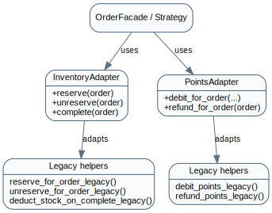
Рисунок 6 — UML-диаграмма паттерна Adapter

**Фрагмент кода:**
```python
class InventoryAdapter:
    def __init__(self, db: Session):
        self.db = db

    def reserve(self, order):
        reserve_for_order_legacy(self.db, order)

    def unreserve(self, order):
        unreserve_for_order_legacy(self.db, order)

    def complete(self, order):
        deduct_stock_on_complete_legacy(self.db, order)


class PointsAdapter:
    def __init__(self, db: Session):
        self.db = db

    def debit_for_order(self, user_id: str, total: int, order_id: int):
        debit_points_legacy(self.db, user_id, total, order_id)

    def refund_for_order(self, order):
        refund_points_legacy(self.db, order)
```

**Результат применения:**  
Паттерн позволил отделить бизнес-логику сценариев от конкретных вспомогательных функций и подготовил систему к дальнейшей замене внутренних реализаций.

#### 4.2.3. Decorator

**Общее назначение:**  
Паттерн Decorator позволяет динамически добавлять объекту новые обязанности.

**Назначение в проекте:**  
В проекте Decorator используется для добавления логирования и аудита поверх основного сервиса управления заказами без изменения его базовой реализации.

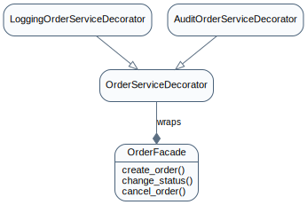
Рисунок 7 — UML-диаграмма паттерна Decorator

**Фрагмент кода:**
```python
from __future__ import annotations


class OrderServiceDecorator:
    def __init__(self, inner_service):
        self.inner_service = inner_service

    def create_order(self, payload, *, x_role: str | None, x_user_id: str | None):
        return self.inner_service.create_order(payload, x_role=x_role, x_user_id=x_user_id)

    def change_status(self, order_id: int, target_status: str, *, x_role: str | None):
        return self.inner_service.change_status(order_id, target_status, x_role=x_role)

    def cancel_order(self, order_id: int, *, x_role: str | None, x_user_id: str | None):
        return self.inner_service.cancel_order(order_id, x_role=x_role, x_user_id=x_user_id)


class LoggingOrderServiceDecorator(OrderServiceDecorator):
    def create_order(self, payload, *, x_role: str | None, x_user_id: str | None):
        print(f"[LOG] create_order role={x_role} user={x_user_id}")
        result = super().create_order(payload, x_role=x_role, x_user_id=x_user_id)
        print(f"[LOG] create_order done order_id={result.id}")
        return result

    def change_status(self, order_id: int, target_status: str, *, x_role: str | None):
        print(f"[LOG] change_status role={x_role} order_id={order_id} -> {target_status}")
        result = super().change_status(order_id, target_status, x_role=x_role)
        print(f"[LOG] change_status done order_id={result.id} status={result.status}")
        return result

    def cancel_order(self, order_id: int, *, x_role: str | None, x_user_id: str | None):
        print(f"[LOG] cancel_order role={x_role} user={x_user_id} order_id={order_id}")
        result = super().cancel_order(order_id, x_role=x_role, x_user_id=x_user_id)
        print(f"[LOG] cancel_order done order_id={result.id} status={result.status}")
        return result


class AuditOrderServiceDecorator(OrderServiceDecorator):
    def __init__(self, inner_service, event_bus):
        super().__init__(inner_service)
        self.event_bus = event_bus

    def create_order(self, payload, *, x_role: str | None, x_user_id: str | None):
        self.event_bus.publish("audit", {"action": "create_order_requested", "user_id": x_user_id})
        return super().create_order(payload, x_role=x_role, x_user_id=x_user_id)

    def change_status(self, order_id: int, target_status: str, *, x_role: str | None):
        self.event_bus.publish("audit", {"action": "change_status_requested", "order_id": order_id, "status": target_status})
        return super().change_status(order_id, target_status, x_role=x_role)

    def cancel_order(self, order_id: int, *, x_role: str | None, x_user_id: str | None):
        self.event_bus.publish("audit", {"action": "cancel_order_requested", "order_id": order_id, "user_id": x_user_id})
        return super().cancel_order(order_id, x_role=x_role, x_user_id=x_user_id)
```

**Результат применения:**  
Декоратор позволил расширить поведение сервиса без нарушения принципа открытости/закрытости и без внедрения вспомогательной логики в основной бизнес-код.

#### 4.2.4. Proxy

**Общее назначение:**  
Паттерн Proxy предоставляет заместитель объекта для контроля доступа к нему.

**Назначение в проекте:**  
В проекте Proxy используется для проверки прав доступа и ролей пользователя перед выполнением операций с заказами и товарами.

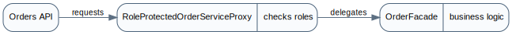
Рисунок 8 — UML-диаграмма паттерна Proxy

**Фрагмент кода:**
```python
from __future__ import annotations

from app.utils import api_error


class RoleProtectedOrderServiceProxy:
    def __init__(self, inner_service):
        self.inner_service = inner_service

    def create_order(self, payload, *, x_role: str | None, x_user_id: str | None):
        if x_role != "buyer":
            api_error(403, "FORBIDDEN", "Недостаточно прав. Требуется роль: buyer.")
        return self.inner_service.create_order(payload, x_role=x_role, x_user_id=x_user_id)

    def change_status(self, order_id: int, target_status: str, *, x_role: str | None):
        if x_role != "fulfillment_admin":
            api_error(403, "FORBIDDEN", "Недостаточно прав. Требуется роль: fulfillment_admin.")
        return self.inner_service.change_status(order_id, target_status, x_role=x_role)

    def cancel_order(self, order_id: int, *, x_role: str | None, x_user_id: str | None):
        if x_role not in {"buyer", "fulfillment_admin"}:
            api_error(403, "FORBIDDEN", "Недостаточно прав. Требуется роль buyer или fulfillment_admin.")
        return self.inner_service.cancel_order(order_id, x_role=x_role, x_user_id=x_user_id)
```

**Результат применения:**  
Прокси позволил вынести проверки доступа из API-обработчиков и сосредоточить их в отдельном компоненте.

### 4.3. Поведенческие паттерны

#### 4.3.1. State

**Общее назначение:**  
Паттерн State позволяет объекту изменять поведение при изменении своего внутреннего состояния.

**Назначение в проекте:**  
В проекте паттерн используется для представления жизненного цикла заказа через отдельные состояния: новый, на проверке, сборка, готов к выдаче, завершён, отменён.

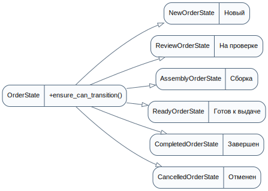
Рисунок 9 — UML-диаграмма паттерна State

**Фрагмент кода:**
```python
from __future__ import annotations

from app.utils import api_error


class OrderState:
    name = ""
    allowed_transitions: set[str] = set()

    def ensure_can_transition(self, target_status: str):
        if target_status not in self.allowed_transitions:
            api_error(
                400,
                "INVALID_STATUS_TRANSITION",
                "Недопустимый переход статуса.",
                {"from": self.name, "to": target_status, "allowed": sorted(self.allowed_transitions)},
            )


class NewOrderState(OrderState):
    name = "Новый"
    allowed_transitions = {"На проверке", "Отменен"}


class ReviewOrderState(OrderState):
    name = "На проверке"
    allowed_transitions = {"Сборка", "Отменен"}


class AssemblyOrderState(OrderState):
    name = "Сборка"
    allowed_transitions = {"Готов к выдаче"}


class ReadyOrderState(OrderState):
    name = "Готов к выдаче"
    allowed_transitions = {"Завершен"}


class CompletedOrderState(OrderState):
    name = "Завершен"
    allowed_transitions = set()


class CancelledOrderState(OrderState):
    name = "Отменен"
    allowed_transitions = set()


class OrderStateFactory:
    STATES = {
        "Новый": NewOrderState,
        "На проверке": ReviewOrderState,
        "Сборка": AssemblyOrderState,
        "Готов к выдаче": ReadyOrderState,
        "Завершен": CompletedOrderState,
        "Отменен": CancelledOrderState,
    }

    @classmethod
    def create(cls, status: str) -> OrderState:
        state_cls = cls.STATES.get(status)
        if not state_cls:
            api_error(400, "UNKNOWN_ORDER_STATE", "Неизвестное состояние заказа.", {"status": status})
        return state_cls()
```

**Результат применения:**  
Паттерн позволил формализовать допустимые переходы между статусами и устранить избыточные условные конструкции.

#### 4.3.2. Strategy

**Общее назначение:**  
Паттерн Strategy определяет семейство алгоритмов и делает их взаимозаменяемыми.

**Назначение в проекте:**  
В проекте Strategy используется для выбора алгоритма обработки перехода заказа в конкретный статус: резервирование, отмена с возвратом, завершение со списанием остатков и т.д.

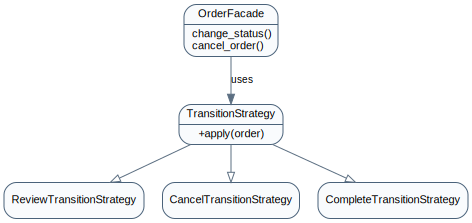
Рисунок 10 — UML-диаграмма паттерна Strategy

**Фрагмент кода:**
```python
class TransitionStrategy:
    def apply(self, order):
        raise NotImplementedError


class NoOpTransitionStrategy(TransitionStrategy):
    def apply(self, order):
        return None


class ReviewTransitionStrategy(TransitionStrategy):
    def __init__(self, inventory_port):
        self.inventory_port = inventory_port

    def apply(self, order):
        self.inventory_port.reserve(order)


class CancelTransitionStrategy(TransitionStrategy):
    def __init__(self, inventory_port, points_port, event_bus: EventBus):
        self.inventory_port = inventory_port
        self.points_port = points_port
        self.event_bus = event_bus

    def apply(self, order):
        self.inventory_port.unreserve(order)
        self.points_port.refund_for_order(order)
        self.event_bus.publish("order_cancelled", {"order_id": order.id, "user_id": order.user_id})


class CompleteTransitionStrategy(TransitionStrategy):
    def __init__(self, inventory_port, event_bus: EventBus):
        self.inventory_port = inventory_port
        self.event_bus = event_bus

    def apply(self, order):
        self.inventory_port.complete(order)
        self.event_bus.publish("order_completed", {"order_id": order.id, "user_id": order.user_id})

class TransitionStrategyFactory:
    @staticmethod
    def create(target_status: str, inventory_port, points_port, event_bus: EventBus) -> TransitionStrategy:
        if target_status == "На проверке":
            return ReviewTransitionStrategy(inventory_port)
        if target_status == "Отменен":
            return CancelTransitionStrategy(inventory_port, points_port, event_bus)
        if target_status == "Завершен":
            return CompleteTransitionStrategy(inventory_port, event_bus)
        return NoOpTransitionStrategy()
```

**Результат применения:**  
Паттерн обеспечил изоляцию изменяемой логики и упростил добавление новых правил обработки статусов.

#### 4.3.3. Command

**Общее назначение:**  
Паттерн Command инкапсулирует запрос как объект.

**Назначение в проекте:**  
В проекте каждая ключевая операция с заказом оформлена как отдельная команда: создание заказа, изменение статуса, отмена заказа.

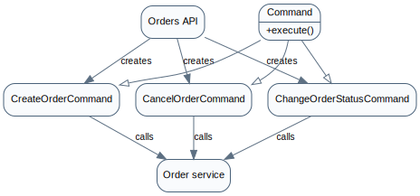
Рисунок 11 — UML-диаграмма паттерна Command

**Фрагмент кода:**
```python
from __future__ import annotations


class CreateOrderCommand:
    def __init__(self, service, payload, x_role: str | None, x_user_id: str | None):
        self.service = service
        self.payload = payload
        self.x_role = x_role
        self.x_user_id = x_user_id

    def execute(self):
        return self.service.create_order(self.payload, x_role=self.x_role, x_user_id=self.x_user_id)


class ChangeOrderStatusCommand:
    def __init__(self, service, order_id: int, target_status: str, x_role: str | None):
        self.service = service
        self.order_id = order_id
        self.target_status = target_status
        self.x_role = x_role

    def execute(self):
        return self.service.change_status(self.order_id, self.target_status, x_role=self.x_role)


class CancelOrderCommand:
    def __init__(self, service, order_id: int, x_role: str | None, x_user_id: str | None):
        self.service = service
        self.order_id = order_id
        self.x_role = x_role
        self.x_user_id = x_user_id

    def execute(self):
        return self.service.cancel_order(self.order_id, x_role=self.x_role, x_user_id=self.x_user_id)
```

**Результат применения:**  
Паттерн позволил отделить инициирование операции от её выполнения и сделать бизнес-действия более явными и модульными.

#### 4.3.4. Observer

**Общее назначение:**  
Паттерн Observer определяет зависимость «один ко многим» между объектами, чтобы при изменении состояния одного объекта автоматически уведомлялись зависимые объекты.

**Назначение в проекте:**  
В проекте Observer используется для обработки событий жизненного цикла заказа: создание, отмена, завершение. На эти события подписаны компоненты логирования, аудита и дополнительные обработчики.

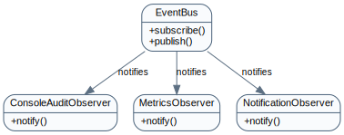
Рисунок 12 — UML-диаграмма паттерна Observer

**Фрагмент кода:**
```python
from __future__ import annotations

from collections import defaultdict
from typing import Callable


class EventBus:
    def __init__(self):
        self._subscribers = defaultdict(list)

    def subscribe(self, event_name: str, subscriber):
        self._subscribers[event_name].append(subscriber)

    def publish(self, event_name: str, payload: dict):
        for subscriber in self._subscribers.get(event_name, []):
            subscriber.notify(event_name, payload)


class ConsoleAuditObserver:
    def notify(self, event_name: str, payload: dict):
        print(f"[AUDIT] {event_name}: {payload}")


class MetricsObserver:
    def notify(self, event_name: str, payload: dict):
        print(f"[METRICS] {event_name}: order_id={payload.get('order_id')}")


class NotificationObserver:
    def notify(self, event_name: str, payload: dict):
        print(f"[NOTIFY] {event_name}: user_id={payload.get('user_id')}")


def build_event_bus() -> EventBus:
    bus = EventBus()
    audit = ConsoleAuditObserver()
    metrics = MetricsObserver()
    notify = NotificationObserver()
    for event in ["order_created", "order_cancelled", "order_completed", "order_status_changed", "audit"]:
        bus.subscribe(event, audit)
    for event in ["order_created", "order_cancelled", "order_completed"]:
        bus.subscribe(event, metrics)
        bus.subscribe(event, notify)
    return bus
```

**Результат применения:**  
Паттерн позволил убрать побочные действия из основного бизнес-сценария и оформить их как независимых подписчиков.

#### 4.3.5. Chain of Responsibility

**Общее назначение:**  
Паттерн Chain of Responsibility передаёт запрос по цепочке обработчиков, пока один из них не выполнит проверку или не отклонит запрос.

**Назначение в проекте:**  
В проекте Chain of Responsibility применяется для последовательной валидации операций: наличие пользователя, корректность списка позиций, существование SKU, достаточность баллов, допустимость перехода статуса.

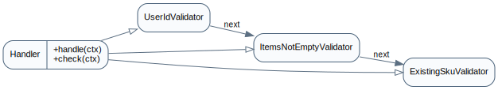
Рисунок 13 — UML-диаграмма паттерна Chain of Responsibility

**Фрагмент кода:**
```python
from __future__ import annotations

from app.utils import api_error


class Handler:
    def __init__(self, next_handler=None):
        self.next_handler = next_handler

    def handle(self, ctx: dict):
        self.check(ctx)
        if self.next_handler:
            self.next_handler.handle(ctx)

    def check(self, ctx: dict):
        raise NotImplementedError


class UserIdValidator(Handler):
    def check(self, ctx: dict):
        if not ctx.get("x_user_id"):
            api_error(422, "VALIDATION_ERROR", "Не передан X-User-Id.")


class ItemsNotEmptyValidator(Handler):
    def check(self, ctx: dict):
        if not ctx.get("items"):
            api_error(422, "VALIDATION_ERROR", "Пустой список items.")


class ExistingSkuValidator(Handler):
    def __init__(self, repo_factory, next_handler=None):
        super().__init__(next_handler=next_handler)
        self.repo_factory = repo_factory

    def check(self, ctx: dict):
        items = ctx.get("items", [])
        skus = [item.sku for item in items]
        variants = self.repo_factory.products().get_variants_by_skus(skus)
        by_sku = {variant.sku for variant in variants}
        for sku in skus:
            if sku not in by_sku:
                api_error(404, "SKU_NOT_FOUND", "SKU не найден.", {"sku": sku})


class StatusPayloadValidator(Handler):
    def check(self, ctx: dict):
        if not ctx.get("target_status"):
            api_error(422, "VALIDATION_ERROR", "Не передан целевой статус.")


class CreateOrderValidationChainFactory:
    @staticmethod
    def build(repo_factory):
        return UserIdValidator(ItemsNotEmptyValidator(ExistingSkuValidator(repo_factory)))
```

**Результат применения:**  
Паттерн позволил разложить сложную валидацию на независимые шаги и сделать проверки переиспользуемыми.

## 5. Применение GRASP

### 5.1. Роли классов

#### 5.1.1. Controller

**Проблема:**  
Необходимо определить компонент, который принимает входной запрос и координирует выполнение бизнес-сценария.

**Решение:**  
В проекте роль Controller выполняют API-обработчики `orders.py` и сервис `OrderFacade`, которые принимают запрос, собирают рабочий сервис и передают выполнение специализированным компонентам.

**Пример кода:**
```python
def build_order_service(db: Session):
    repo_factory = SqlAlchemyRepositoryFactory(db)
    event_bus = build_event_bus()
    validator_chain = CreateOrderValidationChainFactory.build(repo_factory)
    facade = OrderFacade(
        repo_factory=repo_factory,
        validator_chain=validator_chain,
        inventory_port=InventoryAdapter(db),
        points_port=PointsAdapter(db),
        event_bus=event_bus,
    )
    proxy = RoleProtectedOrderServiceProxy(facade)
    audited = AuditOrderServiceDecorator(proxy, event_bus)
    return LoggingOrderServiceDecorator(audited)


@router.post("", status_code=201)
def create_order(
    payload: OrderCreate,
    x_role: Optional[str] = Header(default=None, alias="X-Role"),
    x_user_id: Optional[str] = Header(default=None, alias="X-User-Id"),
    db: Session = Depends(get_db),
):
    command = CreateOrderCommand(build_order_service(db), payload, x_role, x_user_id)
    return order_to_dict(command.execute())
```

**Результат:**  
Управление сценариями стало централизованным и более понятным.

**Связь с GoF-паттернами:**  
Facade, Command.

#### 5.1.2. Creator

**Проблема:**  
Необходимо определить, какой класс должен создавать объект заказа.

**Решение:**  
Создание заказа передано классу `OrderBuilder`, поскольку именно он обладает всей информацией, необходимой для пошагового формирования объекта заказа и его позиций.

**Пример кода:**
```python
from __future__ import annotations

from app.models import Order, OrderItem
from app.utils import now_iso


class OrderBuilder:
    def __init__(self, user_id: str):
        self.order = Order(
            user_id=user_id,
            status="Новый",
            total_points=0,
            created_at=now_iso(),
            updated_at=now_iso(),
            reserved=False,
        )

    def add_item(self, sku: str, qty: int, unit_points: int):
        line_points = qty * unit_points
        self.order.items.append(
            OrderItem(
                sku=sku,
                qty=qty,
                unit_points=unit_points,
                line_points=line_points,
            )
        )
        self.order.total_points += line_points
        return self

    def build(self) -> Order:
        return self.order
```

**Результат:**  
Логика построения заказа вынесена из контроллера и оформлена как отдельная зона ответственности.

**Связь с GoF-паттернами:**  
Builder.

#### 5.1.3. Information Expert

**Проблема:**  
Необходимо определить, какой компонент должен содержать правила переходов состояний и обработки заказа.

**Решение:**  
Ответственность передана состояниям заказа и стратегиям обработки, поскольку именно они владеют знаниями о допустимых переходах и выполняемых действиях.

**Пример кода:**
```python
class OrderState:
    name = ""
    allowed_transitions: set[str] = set()

    def ensure_can_transition(self, target_status: str):
        if target_status not in self.allowed_transitions:
            api_error(
                400,
                "INVALID_STATUS_TRANSITION",
                "Недопустимый переход статуса.",
                {"from": self.name, "to": target_status, "allowed": sorted(self.allowed_transitions)},
            )


class NewOrderState(OrderState):
    name = "Новый"
    allowed_transitions = {"На проверке", "Отменен"}


class ReviewOrderState(OrderState):
    name = "На проверке"
    allowed_transitions = {"Сборка", "Отменен"}


class AssemblyOrderState(OrderState):
    name = "Сборка"
    allowed_transitions = {"Готов к выдаче"}


class ReadyOrderState(OrderState):
    name = "Готов к выдаче"
    allowed_transitions = {"Завершен"}


class CompletedOrderState(OrderState):
    name = "Завершен"
    allowed_transitions = set()


class CancelledOrderState(OrderState):
    name = "Отменен"
    allowed_transitions = set()


class OrderStateFactory:
    STATES = {
        "Новый": NewOrderState,
        "На проверке": ReviewOrderState,
        "Сборка": AssemblyOrderState,
        "Готов к выдаче": ReadyOrderState,
        "Завершен": CompletedOrderState,
        "Отменен": CancelledOrderState,
    }

    @classmethod
    def create(cls, status: str) -> OrderState:
        state_cls = cls.STATES.get(status)
        if not state_cls:
            api_error(400, "UNKNOWN_ORDER_STATE", "Неизвестное состояние заказа.", {"status": status})
        return state_cls()
```

**Результат:**  
Правила предметной области сосредоточены в специализированных классах, а не размазаны по нескольким обработчикам.

**Связь с GoF-паттернами:**  
State, Strategy.

#### 5.1.4. Low Coupling

**Проблема:**  
Высокая связность между API, бизнес-логикой и слоем данных затрудняет развитие системы.

**Решение:**  
В проекте введены интерфейсы репозиториев, фабрика репозиториев, фасад и адаптеры. За счёт этого API работает с сервисом более высокого уровня, а не с прямыми SQLAlchemy-запросами.

**Пример кода:**
```python
from __future__ import annotations

from typing import Optional, Protocol

from app.models import LedgerEntry, Order, Product, UserPoints, Variant


class ProductRepository(Protocol):
    def add(self, product: Product) -> Product: ...
    def get(self, product_id: int) -> Optional[Product]: ...
    def list(self) -> list[Product]: ...
    def get_variants_by_skus(self, skus: list[str]) -> list[Variant]: ...
    def existing_skus(self, skus: list[str]) -> list[str]: ...
    def get_variant_for_update(self, sku: str) -> Optional[Variant]: ...


class OrderRepository(Protocol):
    def add(self, order: Order) -> Order: ...
    def get(self, order_id: int) -> Optional[Order]: ...
    def list(self) -> list[Order]: ...
    def commit(self) -> None: ...
    def rollback(self) -> None: ...


class PointsRepository(Protocol):
    def get_for_update(self, user_id: str) -> Optional[UserPoints]: ...
    def ensure(self, user_id: str) -> UserPoints: ...


class LedgerRepository(Protocol):
    def add(self, entry: LedgerEntry) -> LedgerEntry: ...


class RepositoryFactory(Protocol):
    def products(self) -> ProductRepository: ...
    def orders(self) -> OrderRepository: ...
    def points(self) -> PointsRepository: ...
    def ledger(self) -> LedgerRepository: ...

from __future__ import annotations

from sqlalchemy.orm import Session

from app.repositories.sqlalchemy_repositories import (
    SqlAlchemyLedgerRepository,
    SqlAlchemyOrderRepository,
    SqlAlchemyPointsRepository,
    SqlAlchemyProductRepository,
)


class SqlAlchemyRepositoryFactory:
    def __init__(self, db: Session):
        self.db = db

    def products(self):
        return SqlAlchemyProductRepository(self.db)

    def orders(self):
        return SqlAlchemyOrderRepository(self.db)

    def points(self):
        return SqlAlchemyPointsRepository(self.db)

    def ledger(self):
        return SqlAlchemyLedgerRepository(self.db)
```

**Результат:**  
Изменение одного слоя системы меньше влияет на другие слои.

**Связь с GoF-паттернами:**  
Abstract Factory, Facade, Adapter, Proxy.

#### 5.1.5. High Cohesion

**Проблема:**  
Слишком большое количество разнородной логики в одном модуле ухудшает сопровождение.

**Решение:**  
Код разделён на специализированные модули: репозитории, фасады, команды, стратегии, состояния, валидаторы и наблюдатели.

**Пример кода:**
```text
server/app/
├── api/
├── repositories/
├── services/
├── db.py
├── models.py
└── schemas.py
```

**Результат:**  
Каждый модуль отвечает за ограниченный набор задач, что повышает понятность архитектуры.

**Связь с GoF-паттернами:**  
Facade, Builder, Strategy, Observer, Chain of Responsibility.

### 5.2. Принципы GRASP

#### 5.2.1. Polymorphism

**Проблема:**  
Необходимо избежать большого количества условных операторов при обработке разных статусов и сценариев.

**Решение:**  
В проекте используются разные реализации состояний и стратегий, работающие через единый интерфейс и единый метод `apply()` или `ensure_can_transition()`.

**Пример кода:**
```python
class TransitionStrategy:
    def apply(self, order):
        raise NotImplementedError


class NoOpTransitionStrategy(TransitionStrategy):
    def apply(self, order):
        return None


class ReviewTransitionStrategy(TransitionStrategy):
    def __init__(self, inventory_port):
        self.inventory_port = inventory_port

    def apply(self, order):
        self.inventory_port.reserve(order)


class CancelTransitionStrategy(TransitionStrategy):
    def __init__(self, inventory_port, points_port, event_bus: EventBus):
        self.inventory_port = inventory_port
        self.points_port = points_port
        self.event_bus = event_bus

    def apply(self, order):
        self.inventory_port.unreserve(order)
        self.points_port.refund_for_order(order)
        self.event_bus.publish("order_cancelled", {"order_id": order.id, "user_id": order.user_id})


class CompleteTransitionStrategy(TransitionStrategy):
    def __init__(self, inventory_port, event_bus: EventBus):
        self.inventory_port = inventory_port
        self.event_bus = event_bus

    def apply(self, order):
        self.inventory_port.complete(order)
        self.event_bus.publish("order_completed", {"order_id": order.id, "user_id": order.user_id})
```

**Результат:**  
Добавление новой логики стало возможным без переписывания уже существующих ветвлений.

**Связь с GoF-паттернами:**  
State, Strategy.

#### 5.2.2. Indirection

**Проблема:**  
Прямое взаимодействие между API и слоем данных приводит к жёсткой связанности.

**Решение:**  
Между API и репозиториями введены промежуточные компоненты: фасад, команды, прокси и адаптеры.

**Пример кода:**
```python
def build_order_service(db: Session):
    repo_factory = SqlAlchemyRepositoryFactory(db)
    event_bus = build_event_bus()
    validator_chain = CreateOrderValidationChainFactory.build(repo_factory)
    facade = OrderFacade(
        repo_factory=repo_factory,
        validator_chain=validator_chain,
        inventory_port=InventoryAdapter(db),
        points_port=PointsAdapter(db),
        event_bus=event_bus,
    )
    proxy = RoleProtectedOrderServiceProxy(facade)
    audited = AuditOrderServiceDecorator(proxy, event_bus)
    return LoggingOrderServiceDecorator(audited)
```

**Результат:**  
Архитектура стала более гибкой и пригодной для изменений.

**Связь с GoF-паттернами:**  
Facade, Proxy, Command, Adapter.

#### 5.2.3. Protected Variations

**Проблема:**  
Изменяемые части системы, такие как правила обработки статусов и доступ к данным, должны быть защищены от прямого влияния на остальной код.

**Решение:**  
В проекте изменяемые части системы инкапсулированы в интерфейсах, фабриках, стратегиях и адаптерах.

**Пример кода:**
```python
from __future__ import annotations

from typing import Optional, Protocol

from app.models import LedgerEntry, Order, Product, UserPoints, Variant


class ProductRepository(Protocol):
    def add(self, product: Product) -> Product: ...
    def get(self, product_id: int) -> Optional[Product]: ...
    def list(self) -> list[Product]: ...
    def get_variants_by_skus(self, skus: list[str]) -> list[Variant]: ...
    def existing_skus(self, skus: list[str]) -> list[str]: ...
    def get_variant_for_update(self, sku: str) -> Optional[Variant]: ...


class OrderRepository(Protocol):
    def add(self, order: Order) -> Order: ...
    def get(self, order_id: int) -> Optional[Order]: ...
    def list(self) -> list[Order]: ...
    def commit(self) -> None: ...
    def rollback(self) -> None: ...


class PointsRepository(Protocol):
    def get_for_update(self, user_id: str) -> Optional[UserPoints]: ...
    def ensure(self, user_id: str) -> UserPoints: ...


class LedgerRepository(Protocol):
    def add(self, entry: LedgerEntry) -> LedgerEntry: ...


class RepositoryFactory(Protocol):
    def products(self) -> ProductRepository: ...
    def orders(self) -> OrderRepository: ...
    def points(self) -> PointsRepository: ...
    def ledger(self) -> LedgerRepository: ...
```

**Результат:**  
Изменение бизнес-правил и внутренних реализаций стало локализованным.

**Связь с GoF-паттернами:**  
Abstract Factory, Strategy, Adapter, State.

### 5.3. Свойство программы

#### 5.3.1. Расширяемость

**Проблема:**  
Система должна допускать добавление новых статусов заказа, новых проверок и новых вариантов обработки без переработки всей архитектуры.

**Решение:**  
Архитектура была перестроена на основе набора паттернов GoF и принципов GRASP, что позволило локализовать изменяемые участки логики.

**Пример кода:**
```python
class OrderStateFactory:
    STATES = {
        "Новый": NewOrderState,
        "На проверке": ReviewOrderState,
        "Сборка": AssemblyOrderState,
        "Готов к выдаче": ReadyOrderState,
        "Завершен": CompletedOrderState,
        "Отменен": CancelledOrderState,
    }

    @classmethod
    def create(cls, status: str) -> OrderState:
        state_cls = cls.STATES.get(status)
        if not state_cls:
            api_error(400, "UNKNOWN_ORDER_STATE", "Неизвестное состояние заказа.", {"status": status})
        return state_cls()

class TransitionStrategyFactory:
    @staticmethod
    def create(target_status: str, inventory_port, points_port, event_bus: EventBus) -> TransitionStrategy:
        if target_status == "На проверке":
            return ReviewTransitionStrategy(inventory_port)
        if target_status == "Отменен":
            return CancelTransitionStrategy(inventory_port, points_port, event_bus)
        if target_status == "Завершен":
            return CompleteTransitionStrategy(inventory_port, event_bus)
        return NoOpTransitionStrategy()
```

**Результат:**  
Система может развиваться через добавление новых классов и модулей, а не через усложнение существующих функций.

**Связь с GoF-паттернами:**  
State, Strategy, Observer, Abstract Factory, Chain of Responsibility.

## 6. Итоговая структура модулей после рефакторинга

После рефакторинга backend был разделён на следующие основные части:
- `db.py` — подключение к базе данных;
- `models.py` — ORM-модели;
- `schemas.py` — Pydantic-схемы;
- `repositories/` — интерфейсы и реализации доступа к данным;
- `services/order_builder.py` — построение заказа;
- `services/order_facade.py` — единая точка бизнес-сценариев;
- `services/commands.py` — команды;
- `services/states.py` — состояния заказа;
- `services/strategies.py` — стратегии обработки;
- `services/validators.py` — цепочка проверок;
- `services/observers.py` — события и подписчики;
- `services/order_proxy.py` — контроль доступа;
- `services/order_decorators.py` — расширение поведения сервиса;
- `services/adapters.py` — адаптация вспомогательной логики;
- `api/` — HTTP-роуты приложения.

Такая структура позволила отделить транспортный уровень, бизнес-логику и доступ к данным, а также обеспечить более чистую архитектурную организацию проекта.

## 7. Вывод

В ходе выполнения лабораторной работы был выполнен архитектурный рефакторинг существующей программной системы с применением паттернов проектирования **GoF** и подхода **GRASP**.

Внедрение паттернов позволило:
- уменьшить связность между частями системы;
- повысить связность внутри компонентов;
- упростить сопровождение и развитие кода;
- сделать архитектуру более модульной, понятной и расширяемой.

Поставленные цели лабораторной работы достигнуты в полном объеме.
